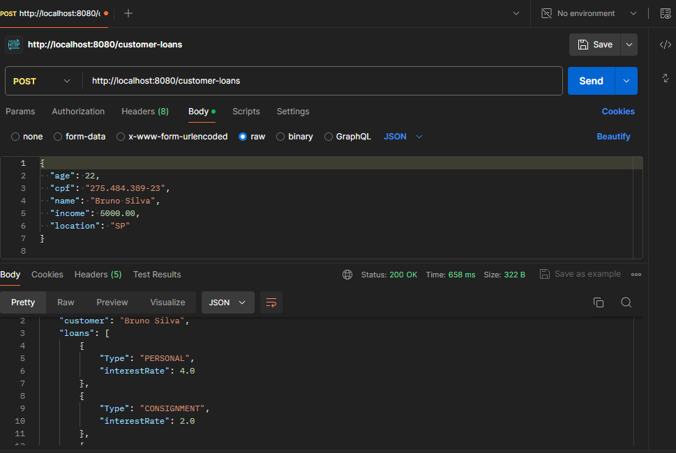

<h2 align="center">
  Desafio Backend: Empréstimos (Loans)
</h2>

Resolução do desafio proposto pelo repositorio Backend Brasil, confira detalhes [neste link](https://github.com/backend-br/desafios/blob/master/loans/PROBLEM.md).

## :rocket: Tecnologias utilizadas

* Java
* Spring Boot
* Junit 5

:mag: Baixe o projeto e teste você mesmo na prática.

## Resultado:

